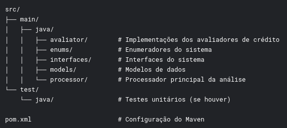
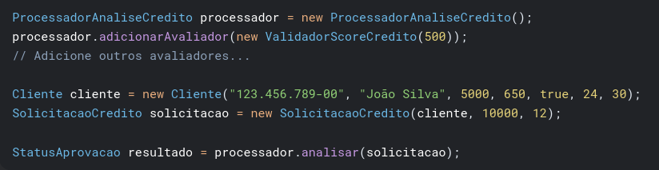
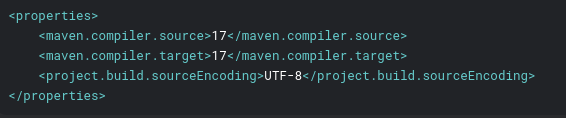

<h1 align="center"> Sistema de Análise de Crédito em Java </h1>

Este repositório contém um sistema de análise de crédito implementado em Java utilizando Maven, que avalia solicitações de empréstimo com base em múltiplos critérios de aprovação.

***

# :hammer: Funcionalidades

* Sistema modular com avaliadores independentes para cada critério de crédito
* Processamento sequencial das regras de aprovação
* Feedback detalhado em caso de reprovação
* Registro completo da solicitação incluindo data/hora e status
* Gerenciamento de dependências com Maven

*** 

# 📊 Regras de Análise

O sistema implementa 6 validadores principais:

1. **Validador de Tempo de Emprego** - Verifica tempo mínimo de emprego  
2. **Validador de Score de Crédito** - Avalia score mínimo no Serasa  
3. **Validador de Renda Mínima** - Checa renda compatível com valor solicitado  
4. **Validador de Idade Mínima** - Confirma idade mínima para empréstimo  
5. **Validador de Histórico de Dívidas** - Analisa dívidas pendentes  
6. **Validador de CPF Limpo** - Verifica se o nome está limpo

***

# 📁 Estrutura do Projeto  

   

***

# ⚙️ Pré-requisitos 

* Java 17 ou superior
* MAven 3.8.1 ou superior

***

# 🛠️ Como Usar 

1. Clone o repositório
2. Execute `mvn clean install` para baixar as dependências e compilar o projeto
3. Importe o projeto em sua IDE como um projeto Maven
4. Crie uma instância de `ProcessadorAnaliseCredito`
5. Adicione os avaliadores necessários com os parâmetros desejados
6. Crie um objeto `Cliente` com os dados do solicitante
7. Crie uma `SolicitacaoCredito` com os detalhes do empréstimo
8. Execute a análise chamando `analisar()` no processador

   
*Exemplo básico*

***

# 📜 Configuração do Maven

O projeto está configurado para usar Java 17, conforme especificado no `pom.xml`

 
